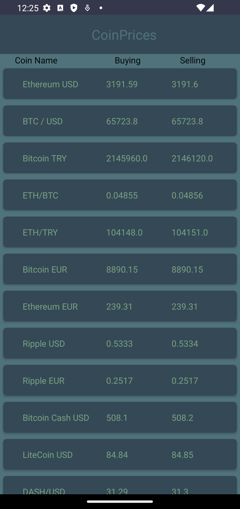

# Crypto Tracker App

This Kotlin-based Android application is a mobile app that allows users to view the names and buy-sell prices of various cryptocurrencies.

## Features

- Coin List: Lists the names and buy-sell prices of various cryptocurrencies for the user.

## Technologies Used

- MVVM Architecture: Utilizes the Model-View-ViewModel architecture for managing data and separating UI concerns.
- LiveData: Used for updating data flow and UI updates.
- Dependency Injection: Dagger Hilt library is employed for dependency injection and managing app components.
- Retrofit API: Fetches pharmacy data and location information from the server.

## Installation

1.git clone https://github.com/user/coin-tracker.git

2.Open Android Studio and import the project files.

3.Build and run the project.

## Usage
1.Launch the application.

2.The coin list will be displayed.

## Contributions
- Contributions and feedback are welcome. Feel free to contribute by opening an Issue or sending a Pull Request.

## Screenshots

